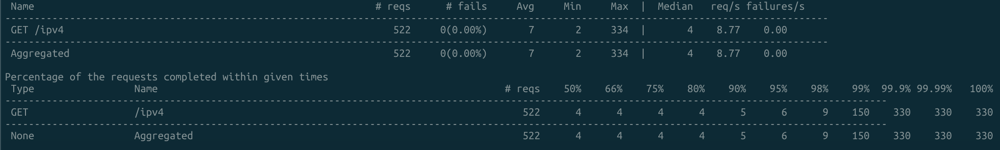

# Spring Boot를 이용한 차단 IP 목록 처리
### Spring properties에 CIDR 표기법으로 등록 된 IP를 블랙리스트 처리
#### 1. 설정 예시 - filter 처리 여부에 대한 값과 IP 리스트 등록
```
blacklists:
  filter: true
  ## ip 3,000,000 개
  ips: >-
    100.1.0.0/12,101.1.0.0/12,102.1.0.0/13,103.1.0.0/14,
    10.1.0.0/16,10.2.0.0/17,10.3.0.0/18,10.4.0.0/22,10.5.0.0/23,10.6.0.0/25,10.7.0.0/26
```
#### 2. 등록 된 IP 리스트는 CIDR 표기법으로 직접 비교가 용이하지 않아 properties가 읽혀질 때 CIRD 표기를 CIDR 내 모든 IP로 변환 처리
#### 변환 처리 로직에서 filter를 위해 HashSet으로 별도 저장
```
@Slf4j
@Component
@ConfigurationProperties("blacklists")
@Getter
public class BlackListsProperty {
    private boolean filter;
    private List<String> ips;
    private HashSet<String> ipHsahs = new HashSet<>();

    public void setFilter(boolean filter) {
        this.filter = filter;
    }

    public void setIps(List<String> ips) {
        this.ips = ips;
        for (String ip : this.getIps()) {
            SubnetUtils subnetUtils = new SubnetUtils(ip);
            subnetUtils.setInclusiveHostCount(true);
            this.ipHsahs.addAll(Arrays.asList(subnetUtils.getInfo().getAllAddresses()));
        }
        log.info("ipHsahs size = {}", this.ipHsahs.size());
    }
}
```
#### 3. webfilter를 이용하여 filter 처리 - blacklist 경우 blacklist 추가
```
@Override
public Mono<Void> filter(ServerWebExchange exchange, WebFilterChain chain) {
    if (blackListsProperty.isFilter()) {
        String remoteIp = Optional.ofNullable(exchange.getRequest().getHeaders().get("X-FORWARDED-FOR"))
                .orElseGet(() -> Arrays.asList(exchange.getRequest().getRemoteAddress().getAddress().getHostAddress()))
                .get(0);

        if (blackListsProperty.getIpHsahs().contains(remoteIp)) {
            return chain.filter(exchange.mutate().request(
                    exchange.getRequest().mutate().header("blacklist","true").build()
                    ).build()
            );
        }
    }

    return chain.filter(exchange);
}
```
---
### 테스트를 위한 빌드 과정
#### 1. 빌드(google jib를 이용하여 docker image로 빌드)
```
git clone https://github.com/underbell/springboot-ipfilter.git
cd springboot-ipfilter
./gradlew clean jibDockerBuild -x test 
```
###### blacklist 설정 변경이 필요한 경우 application.yml 수정

#### 2. docker run
```
docker run -p 8080:8080 --name ipfilter ipfilter:0.0.1
```

#### 3. api /ipv4 test - status is Allow or Deny
```
curl -XGET http://localhost:8080/ipv4

{"sourceIp":"172.17.0.1","status":"Allow"}
```
---
### [locust](https://locust.io/) 를 이용한 benchmark test 
###### test1. 차단 IP에 해당하는 IP를 랜덤으로 동시성 30, 60초가 수행
```
cd benchmark
locust -f test.py --headless -c 30 -r 30 -t 60s
```

###### test2. 차단 IP 목록 300 만개 3회 수행
```
application.yml 내 설정 변경 후 빌드 후 test1과 동일하게 테스트
include: 'blacklist-300'
```

---

---

###### test3. 차단 IP 목록 3000 만개 3회 수행
```
application.yml 내 설정 변경 후 빌드 후 test1과 동일하게 테스트
include: 'blacklist-3000'
```

---

---

---

#### HashSet 사용으로 처리 성능에는 크게 영향이 없으나 어플리케이션이 처음 구동 되는 시간의 차이는 발생한다.
#### 이해를 돕기위해 웹 이미지


